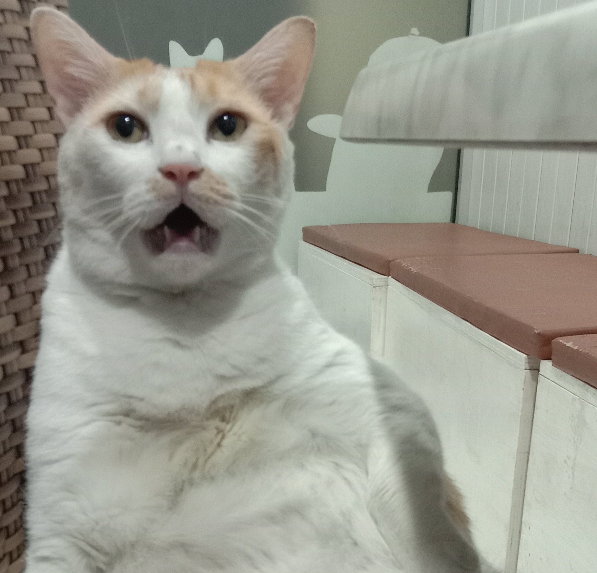

### Hi there 👋

<!-- Banner -->

<!-- End of Banner -->
<!-- About me -->
Selamat datang di Github Frise Anesha Lutia!
Masih belajar!

<!-- End of About me -->

<!-- Github Statistics -->
## AbFrise  

<!-- tools stack -->

  
<b>📫 Reach me on</b>

  

<!-- end of tools stack -->
